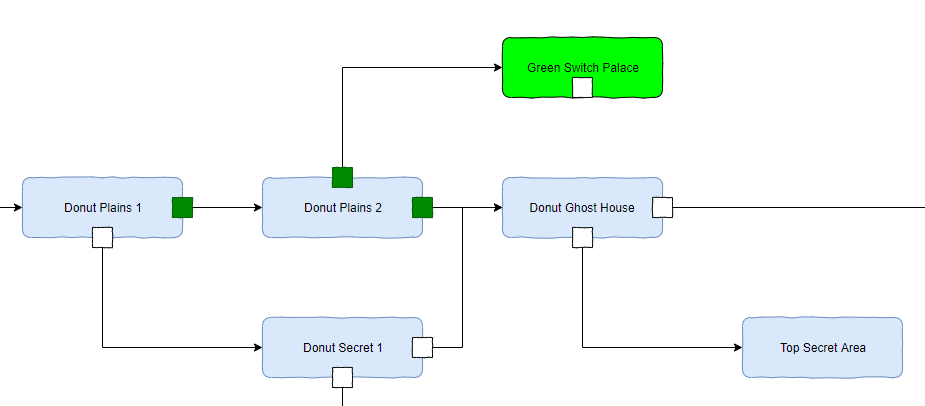
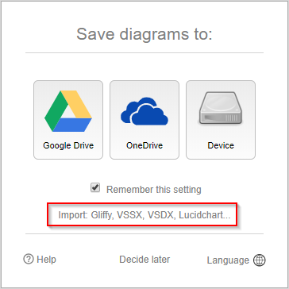

# Super Mario World Level Map
***THIS IS NOT AN INTERACTIVE TOOL***.  You must first download the file and use [Draw.io](https://www.draw.io/) to use it.

This is a checklist map of all 96 Super Mario World level exits.  It is a map in that it shows you which level exits lead to which levels so you can follow the map from one exit/level to another.  It is a checklist in that it allows you to check off which exits you have completed.

## Example

Here `Donut Plains 1` has 2 exits, 1 of which has been completed as indicated by a small box with a green fill.  The completed exit leads to `Donut Plains 2` which has both exits completed.  The `Green Switch Palace` has not been completed since the small box has no fill.

## How to Use the Map
This map was made using [Draw.io](https://www.draw.io/) which is an awesome free tool for making all sorts of diagrams.  Diagrams made using [Draw.io](https://www.draw.io/) can be exported and imported using XML.  To use this map you will need to 

1.  Download the map XML to your computer.
2.  Use a modern browser to navigate to [Draw.io](https://www.draw.io/) ([*https://www.draw.io/*](https://www.draw.io/)).
3.  If you are presented with a *Save diagrams to* dialog
    1.  Click the Import text under the `Remember this setting` checkbox.

4.  If you are presented with a different dialog you probably used [Draw.io](https://www.draw.io/) before and it has remembered your settings.
    1.  You can either find your way back to the *Save diagrams to* dialog,
    2.  Or you can start a new diagram and use the **File** > **Import From** option.
4.  Browse to the map XML file you downloaded in step 1.

You can now use [Draw.io](https://www.draw.io/) to update the diagram and *check off* the exits you have completed.

Another option is to use the print feature in [Draw.io](https://www.draw.io/) to print a hard copy of the diagram so you can mark it up using a writing instrument.

# References
I do not know how official the sites I used are but the information they provided seems to be correct.

* Information on which exit leads to which level is from [Fandom Super Mario World](https://nintendo.fandom.com/wiki/Super_Mario_World).
* The 96 exit speed run routes I used to check if the map was correct is located at [https://smwspeedruns.com/96_Exit](https://smwspeedruns.com/96_Exit).
* The speedrun leaderboards for the 96 exit category can be found at [speedrun.com](https://www.speedrun.com/smw#96_Exit).
